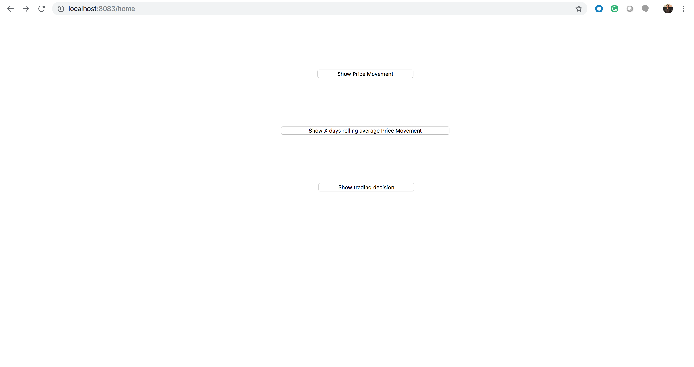
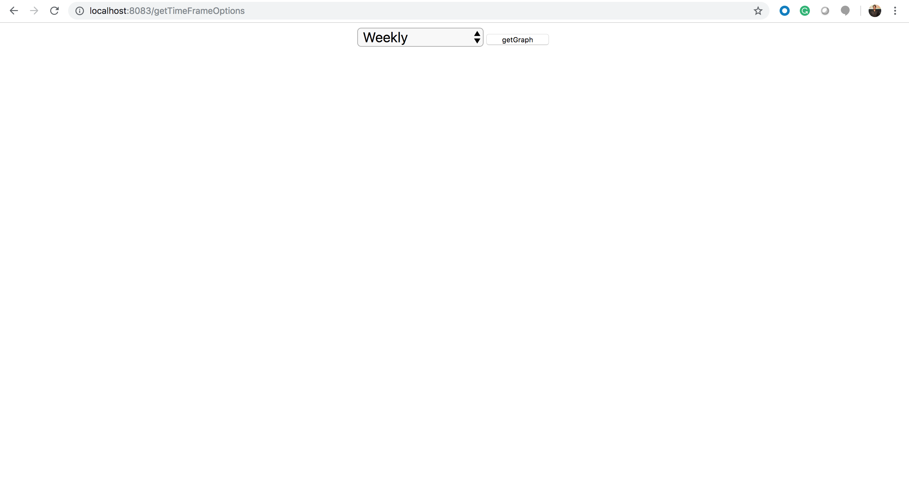
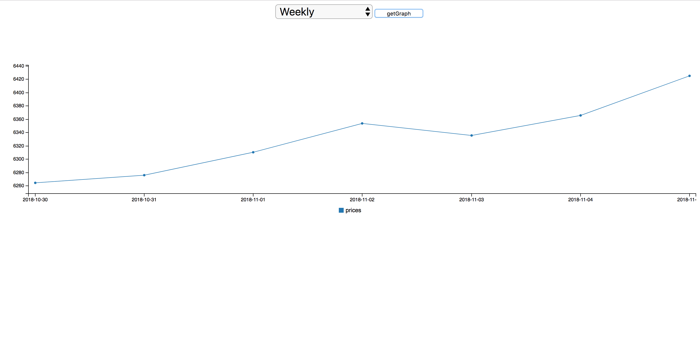
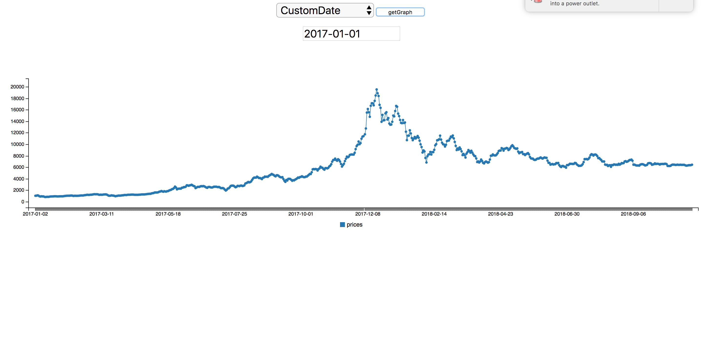
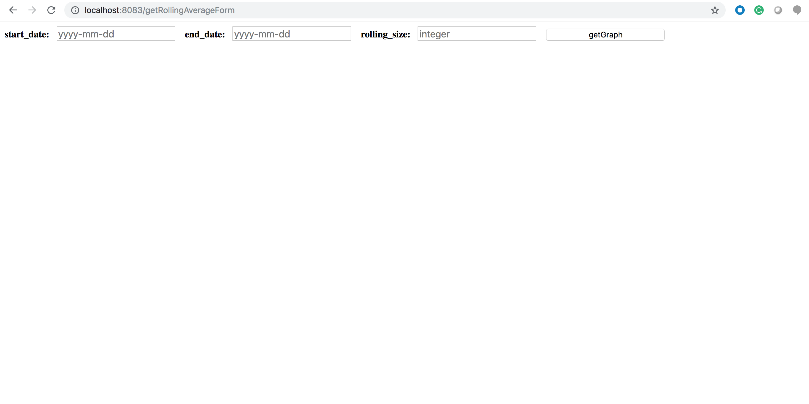
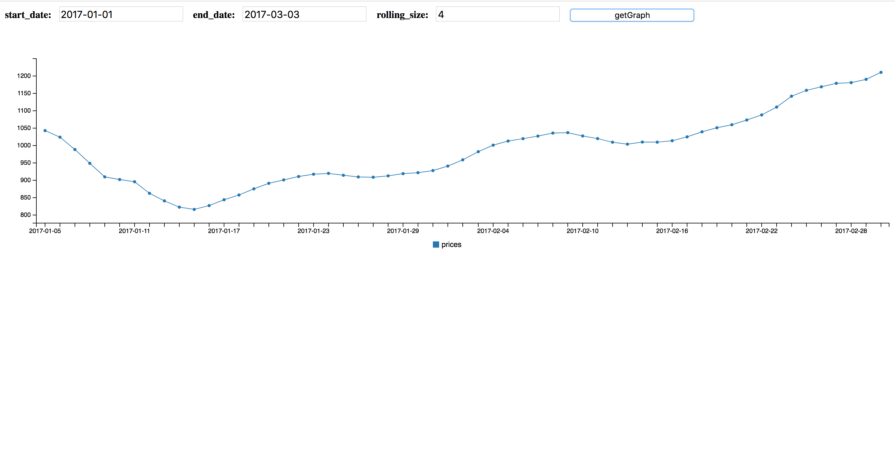
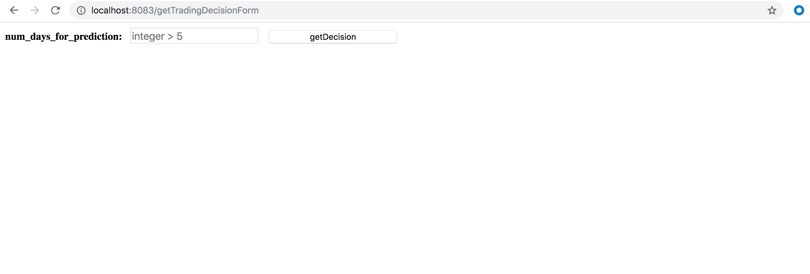
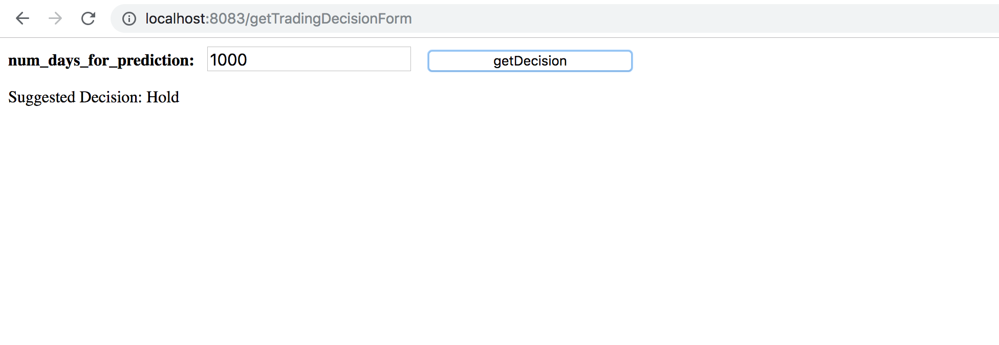
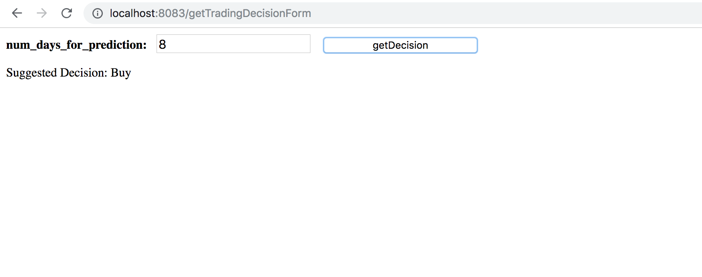

**Rest API for BitCoin Price analysis** 

* BitCoin Rest API is developed using Scala(SPRING),Spark(ARIMA algorithm).
---

## Introduction

 BitCoin Rest API provides user to see the price movement for last week,month,year and for any custom date and also 
  gives flexibility to see movement of rolling average price between any two custom dates.

---

## Usage

Next, you’ll add a new file to this repository.

1. Clone the project.
2. Run the main class of SpringBootRestApplication in package 'com.tookitaki.assignment.bitcoin'.
3. Click on the following url to open the home page of the Rest API which looks like the following.
   [http://localhost:8083/home](http://localhost:8083/home)
   
   
   
4. Click on the **Show price movement** button which displays following page.

    
    
    By clicking on getGraph button you will get graph with price on y axis and date on x axis.
    
    
    By selecting CustomDate option a text filed will be displayed to enter the date.Enter date in **yyyy-mm-dd** format.
    

5. Click on **Show X days rolling average Price Movement** button which displays following page.
     
   Fill the values in the form displayed and click on get graph. A sample graph is shown below.
     

6. Click on **Show trading decision** button which displays following page.
      
   Give the number of days to consider to train the ARIMA(Auto Regression Integrated Moving Average) model to give the trading decision.
   Following are the sample output.
      
      
      
---

## References

Following links are used as references

1. [https://github.com/sryza/spark-timeseries](https://github.com/sryza/spark-timeseries).
2. [http://blog.cloudera.com/blog/2015/12/spark-ts-a-new-library-for-analyzing-time-series-data-with-apache-spark/](http://blog.cloudera.com/blog/2015/12/spark-ts-a-new-library-for-analyzing-time-series-data-with-apache-spark/).
3. [https://towardsdatascience.com/bitcoin-price-prediction-using-time-series-forecasting-9f468f7174d3](https://towardsdatascience.com/bitcoin-price-prediction-using-time-series-forecasting-9f468f7174d3).
4. [https://medium.com/swlh/developing-bitcoin-algorithmic-trading-strategies-bfdde5d5f6e0](https://medium.com/swlh/developing-bitcoin-algorithmic-trading-strategies-bfdde5d5f6e0).
5. ARIMA model not available in spark. So, I used API developed by cloudera to develop price prediction with time series.
